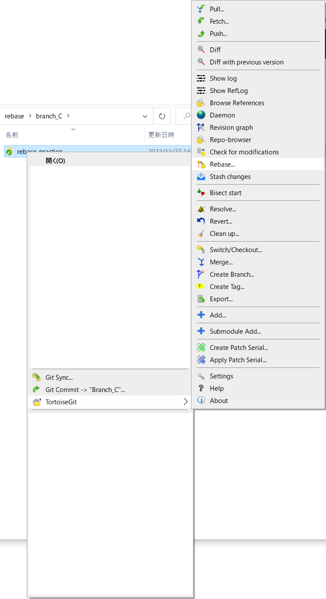
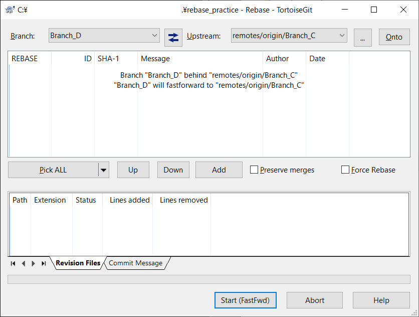
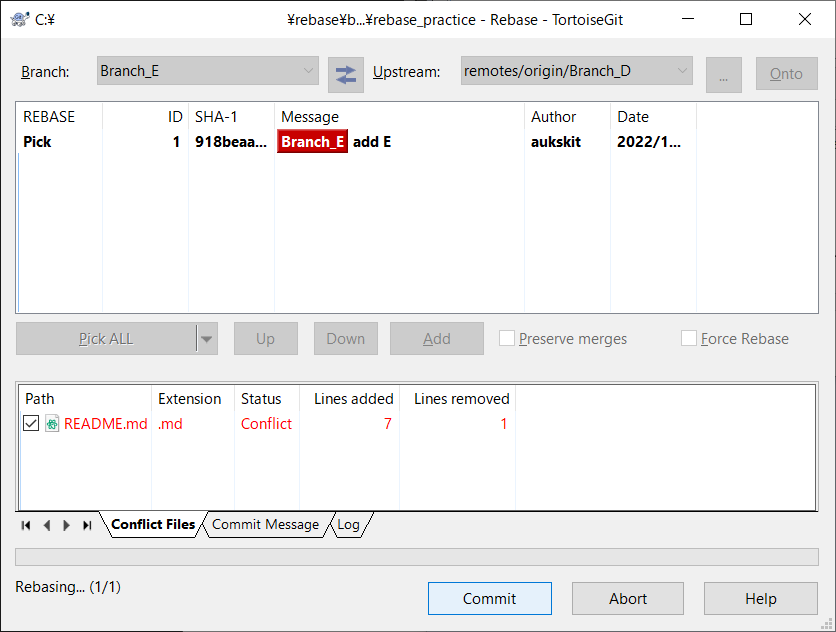
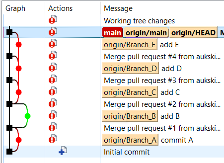

# rebase_practice

Branch_A: add this line

Branch_B: add this line

Branch_C: add this line

Branch_D: add this line

Branch_E: add this line

## Rebase

TortoiseGitからRebaseするときは

Upstreamに、リベース元のブランチを選択して`Start(FastFwd)`をクリック

Conflictが発生した場合は

エディタでConflictを解消するとcommitできるようになる

`右クリック` > `TortoigeGit` > `Show log`

